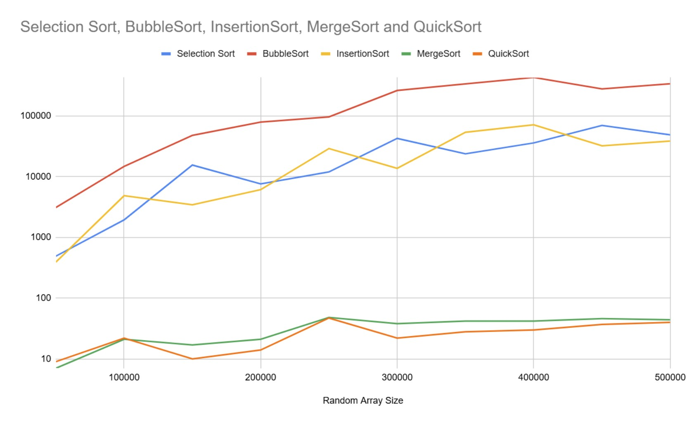
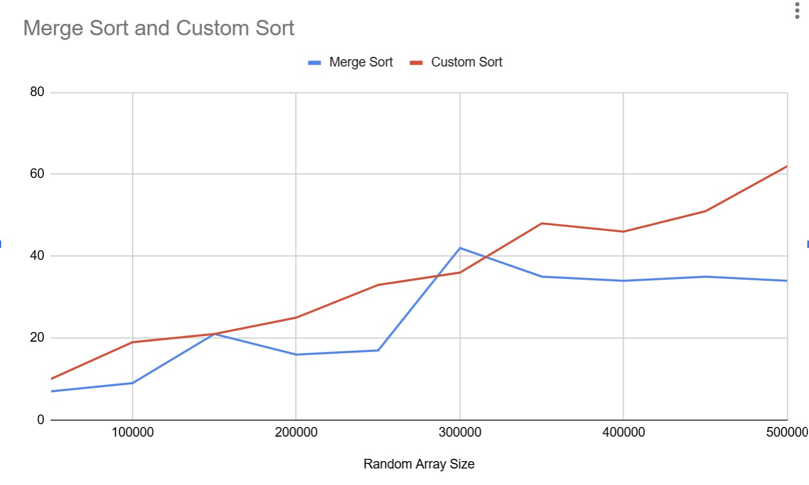

# 📚 CS245 Data Structures and Algorithms – Project 1

**Author:** Paul Gedrimas

---

## 📊 Sorting Algorithm Performance

Below is an image showing the comparison of various sorting algorithms by their execution time:



🔗 **Google Sheet with full results:** [View Here](https://docs.google.com/spreadsheets/d/11W-r58t4C7OAGtZDibMa1pimRzJlQCnWQHIbzsJ-Op8/edit?usp=sharing)

---

## 🧑‍💻 Project Overview

This project follows **Object-Oriented Programming (OOP)** principles to implement, test, and compare multiple sorting algorithms.

### 🏗️ Design
- **Abstract Class – `ArraySort`**
    - Manages a stopwatch using Java's `System.nanoTime()`.
    - Creates and clears the copied array after sorting.
    - Provides `isSorted()` method to verify correctness of each sorting algorithm.
    - Terminates the main loop if a sorting algorithm fails to sort correctly.

- **Concrete Sorting Algorithm Classes**
    - Each algorithm inherits from `ArraySort`.
    - Implements `startSort()` method to override the abstract method with its unique logic.
    - Some algorithms include private helper methods (e.g., merge helpers) for encapsulation.

---

## 🧩 Custom Sorting Algorithm (Updated Pseudocode)

```text
1. Initialize three pointers:
   - segmentStart = 0
   - trailing = 0
   - leading = 1

2. Loop through the array:
   - Compare element at `leading` with element at `trailing`.
   - If `array[leading] < array[trailing]`:
       a) Copy elements from `segmentStart` to `trailing` into a temporary array.
       b) Add this array to a list of double arrays.
       c) Move `segmentStart` to `leading`.
       d) Set `trailing = segmentStart - 1`.
       e) Continue looping.

3. After collecting all segments, merge them **pairwise**:
   - In each pass, merge consecutive pairs of segments.
   - If there's an odd segment, carry it over to the next round.
   - Continue until only one segment remains.

4. Return the fully sorted array once all segments are merged.
```

This updated approach performs **balanced pairwise merging** rather than always merging into the first segment, leading to more efficient merging for cases with many small segments.

---

## ⏱️ Time & Space Complexity

- **Best Case:** `O(n)` – If the array is already sorted, only one segment is created, so merging loop is skipped.
- **Worst Case:** `O(n log n)` In the worst case (fully reversed array), This roughly approaches `O(n log n)`. Each step reduces the array segments to merge by 2. So steps become log base 2 N. The worst case scenario for comparisons for a fully reversed array is n/2 so the algorithm would be (n/2)*n so ultimetly it would be `O(n log n)`.
- **Space Complexity:** `O(n)` – Requires additional space to hold the copied segments and merged results. So total is n (segments) + n(new segments, which replaces segments) so 2n, therefore O(n)

---

## 📊 Custom Algorithm Performance

Below is an image showing the comparison of the custom sorting algorithm against merge sort



The algorithm performed overall slightly worse than merge sort.

---

## 🎯 Summary

This project was a fun and educational exercise in implementing multiple sorting algorithms, measuring their performance, and adhering to clean OOP design principles.

> _Fun project, hope you enjoyed reviewing my work!_
